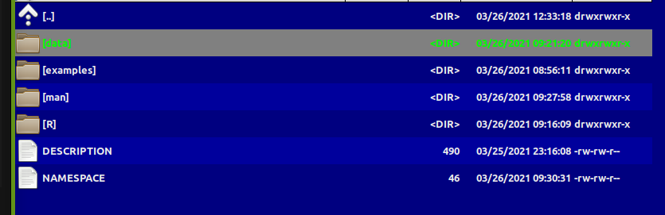
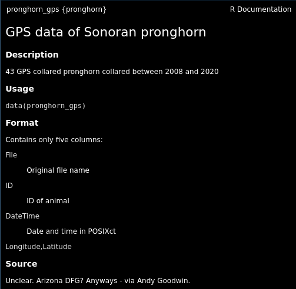
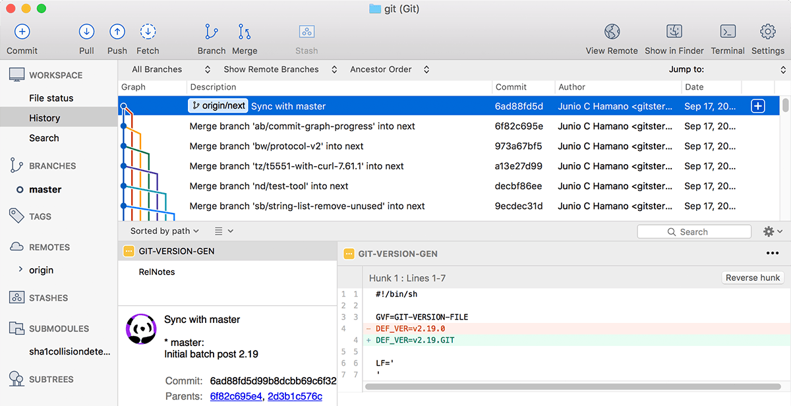
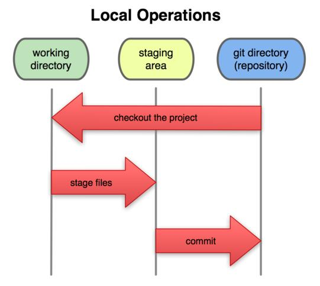
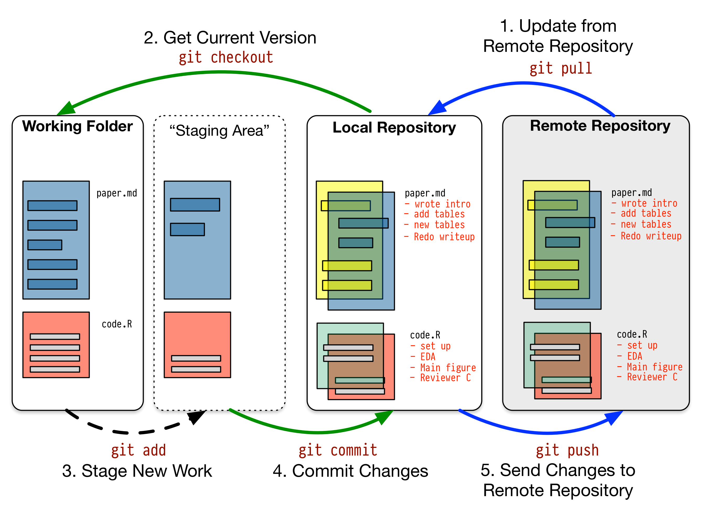
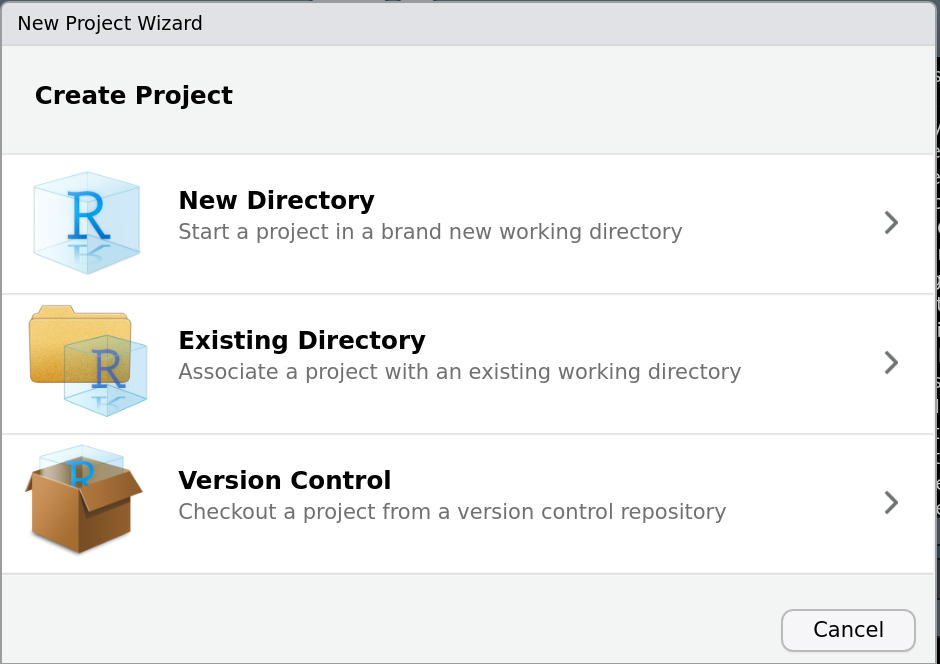

<style type="text/css">
pre {
  font-size: 18px
}
</style>

```{r setup, include=FALSE}
knitr::opts_chunk$set(echo = TRUE, cache = TRUE, message = FALSE, warning = FALSE)
```

# Goals

- Learn to build R packaged
- Learn workflow with Github

# Part I: building an R package

## Why!?

<div class='left' style='float:left;width:48%'>

- Conquer and permanently tame confusing folder soups of data and R scripts


eventually: 

- (truly) publish tools and methods

</div>
<div class='right' style='float:right;width:48%'>


</div>


# Processing before:

(this is a small snippet of a data processing nightmare)

```{r, eval = FALSE}
gps.dir <- "data/SonoranPronghorn/Locations_GPSCollarTelemetry/"
pronghorn <- read.csv(paste0(gps.dir,f.v1[i])) %>% processRaw_v1(id = id.v1[i], filename = f.v1[i])
pronghorn.sf <- st_as_sf(df.raw, coords = c("ECEF_X..m.","ECEF_Y..m.","ECEF_Z..m.")) %>% st_set_crs(4978) %>% 
      st_transform(4326) %>% st_coordinates
    
    with(df.raw, 
         data.frame(
           File = filename, 
           ID = CollarID,
           DateTime = mdy_hms(paste(UTC_Date, UTC_Time)),
           Latitude = ll[,"Y"], 
           Longitude = ll[,"X"],
           Elevation = ll[,"Z"])) %>% 
      subset(!is.na(DateTime))
```


# Processing now

```{r, eval = FALSE}
require(pronghorn)
data("pronghorn_gps")
str(pronghorn_gps)
```
```{r, echo = FALSE}
require(pronghorn)
data("pronghorn_gps")
str(pronghorn_gps[,-1])
```


</div>

# R package structure





- `R` folder contains code
- `data` folder contains data - as `.rda`
- `man` folder contains documentation 
- `DESCRIPTION` - file contains essential info
- `NAMESPACE` - complicated file (*mainly automated*)

<div class='left' style='float:left;width:48%'>
</div>
<div class='right' style='float:right;width:48%'>
</div>


# `DESCRIPTION` file

```
Package: pronghorn
Type: Package
Title: Sonoran pronghorn analysis project
Version: 0.1.0
Author: Elie, Nicky, others
Maintainer: The package maintainer <yourself@somewhere.net>
Description: The pronghorn package is a PRIVATE collaborative package containing processed data, code and results for analysis of sonoran pronghorn.
License: PRIVATE
Encoding: UTF-8
LazyData: false
Depends: lubridate, magrittr, plyr, dplyr, ggplot2, ggpubr, sp, sf, stringr
Suggests: mapview 
RoxygenNote: 7.1.1
```

# Documentation

<div class='left' style='float:left;width:40%'>

R help  document


</div>


<div class='right' style='float:right;width:60%'>

R man file
```
% Generated by roxygen2: do not edit by hand
% Please edit documentation in R/datadocumentation.R
\docType{data}
\name{pronghorn_gps}
\alias{pronghorn_gps}
\title{GPS data of Sonoran pronghorn}
\format{
Contains only five columns:
\describe{
  \item{File}{Original file name}
  \item{ID}{ID of animal}
  \item{DateTime}{Date and time in POSIXct}
  \item{Longitude,Latitude}{}
}
}
\source{
Unclear.  Arizona DFG?  Anyways - via Andy Goodwin.
}
\usage{
data(pronghorn_gps)
}
\description{
43 GPS collared pronghorn collared between 2008 and 2020
}
```

</div> 

# Using Roxygen

Streamlines documentation by turning "comments" into help files. 
Need to install `roxugen2` package and fiddle with some "build" settings.

```
#' GPS data of Sonoran pronghorn
#'
#' 43 GPS collared pronghorn collared between 2008 and 2020
#' 
#' @usage
#' data(pronghorn_gps)
#'
#' @format Contains only five columns:
#' \describe{
#'   \item{File}{Original file name}
#'   \item{ID}{ID of animal}
#'   \item{DateTime}{Date and time in POSIXct}
#'   \item{Longitude,Latitude}{}
#' }
#' @example
#' examples/pronghorn_gps_examples.R
#' @source Unclear.  Arizona DFG?  Anyways - via Andy Goodwin. 
#' @keywords data
```


</div>


# How to create a package

1. By hand

2. `base::package.skeleton()`

3. `usethis::create_package()`

4. build directly off of existing GitHub project

#  Building an R package - lab exercise


> **David** provided some code and a function ...

> **Bernardo** will walk us through building a package from "scratch" ... 


# Part II: `git` and `Github`

**Version control** - a system to track and organize all progress on a project.   Mainly ... programming and coding projects. 
Facilitates **project management**.  

`git` (most common tool) runs *locally*, and tracks all the changes, via command line or a GUI. 

<center>
{with = 80%}
</center>


# Steps of version controlling

<div class='left' style='float:left;width:50%'>
There's a controlled sequence of steps!

- Step 1: **modify** files in your working directory.
- Step 2: **stage** files you’ve worked on. This prepares a snapshot of the directory. 
- Step 3: **commit** the files you’ve staged. This stores that snapshot in the Git repository. Every commit **must** come with a comment. 

Command lines (in the `git bash` terminal):

```
git add
git commit "this is my commit"
```

</div>

<div class='left' style='float:left;width:50%'>

</div>


# `GitHub` (or `GitLab` or `bitbucket`)


<div class='left' style='float:left;width:40%'>

Are **remote** repositories of `git`, which allow multiple people people to work with the **same repository**.

This adds two important steps:

- Step 0: **pull** any changes from remote version of repo
- Step 5: **push** any changes you've "committed" to. 

```
git pull
git push
```


</div>

<div class='right' style='float:right;width:60%'>

{width=100%}

</div>


# How to create a `git` repository and upload to `GitHub`


<div class='left' style='float:left;width:50%'>

## Order 1:

1. Create GitHub repository online
2. Create new R project from `GitHub` repository 
3. Use Rstudio's stage-commit-push-pull tools. 
{width=80%}
</div>

<div class='right' style='float:right;width:50%'>

## Order 2:

1. Create new **R project** (e.g., a package, e.g. `usethis::create_package()`)
2. Create empty repository locally: `usethis::use_git()`
3. Create Github repository: `usethis::use_github()`
4. Use Rstudio's stage-commit-push-pull tools. 

</div>

# Bernardo leads us through the wilderness


